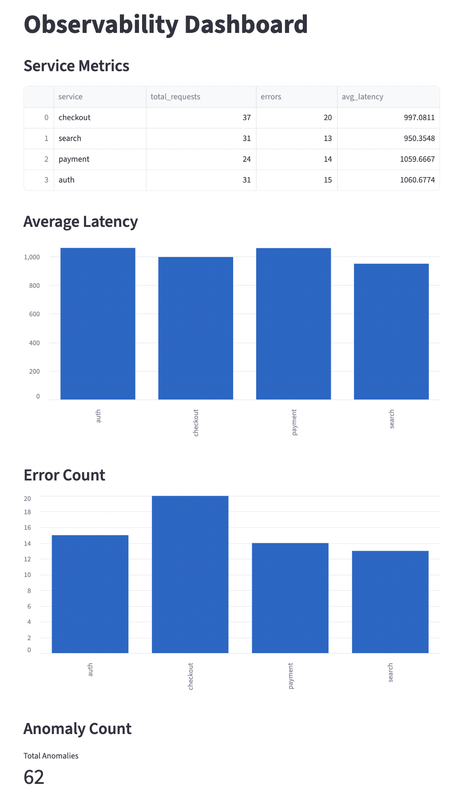

# Real-Time Observability & Anomaly Detection Pipeline

## Overview

This project simulates a **production-grade observability system** that ingests, processes, and analyzes real-time service metrics such as latency, errors, and request volume to monitor system health.

It mirrors real-world monitoring systems used in distributed architectures at companies like Amazon, Netflix, and Uber, demonstrating how backend services are tracked, analyzed, and visualized in real time.

---

## Architecture
Event Producer → FastAPI → Processing Pipeline → PostgreSQL → Streamlit Dashboard

---


### Components

**Event Producer**  
Simulates microservice traffic (auth, payment, checkout, search) and generates real-time events with latency and status.

**FastAPI Service**  
Acts as the ingestion layer, receiving incoming events via REST APIs.

**Processing Pipeline**  
Normalizes incoming events, categorizes latency (low / medium / high), and flags anomalies using rule-based logic.

**PostgreSQL**  
Stores processed metrics and supports aggregation queries for analytics.

**Streamlit Dashboard**  
Visualizes system health in real time through charts and metrics.

---

## ⚙️ Tech Stack

- Python  
- FastAPI  
- PostgreSQL  
- Streamlit  
- Docker & Docker Compose  
- Pandas  

---

## 📊 Features

- Real-time event ingestion and processing  
- Service-level metrics tracking (requests, errors, latency)  
- Latency classification (low / medium / high)  
- Rule-based anomaly detection  
- Interactive dashboard with:
  - Service metrics table  
  - Latency comparison charts  
  - Error distribution  
  - Total anomaly count  

---

## 📸 Dashboard Preview



---

## 🚀 Getting Started

### 1. Clone the repository

```bash```
git clone https://github.com/zubinpaulofficial/real-time-observability-pipeline.git
cd real-time-observability-pipeline

### 2. Start all services

```bash```
docker-compose up --build

### 3. Access the dashboard

http://localhost:8501

---

## Data Flow

- Event producer generates service events
- Events are sent to FastAPI endpoint
- Pipeline processes and enriches data
- Data is stored in PostgreSQL
- Dashboard queries database and visualizes metrics

---

## Example Event

````json
{
  "service": "payment",
  "status": "error",
  "latency_ms": 1377,
  "timestamp": "2026-04-19T18:13:37"
}
```

---

## What This Project Demonstrates

- Designing event-driven data pipelines
- Handling real-time streaming data
- Building backend ingestion services
- Implementing data processing logic
- Creating analytics-ready data models
- Developing interactive dashboards
- Applying observability concepts to distributed systems

---

## Future Improvements

- Statistical anomaly detection (Z-score, moving averages)
- Machine learning-based anomaly detection
- Alerting system (Slack / Email notifications)
- Kafka integration for true streaming architecture
- Time-series database integration (e.g., TimescaleDB)

---

## Why This Matters

Observability is critical in modern distributed systems. This project demonstrates the ability to monitor performance, detect failures early, and convert raw system events into actionable insights.

---

## Author

Zubin Paul
Data Engineer | Data Analyst
